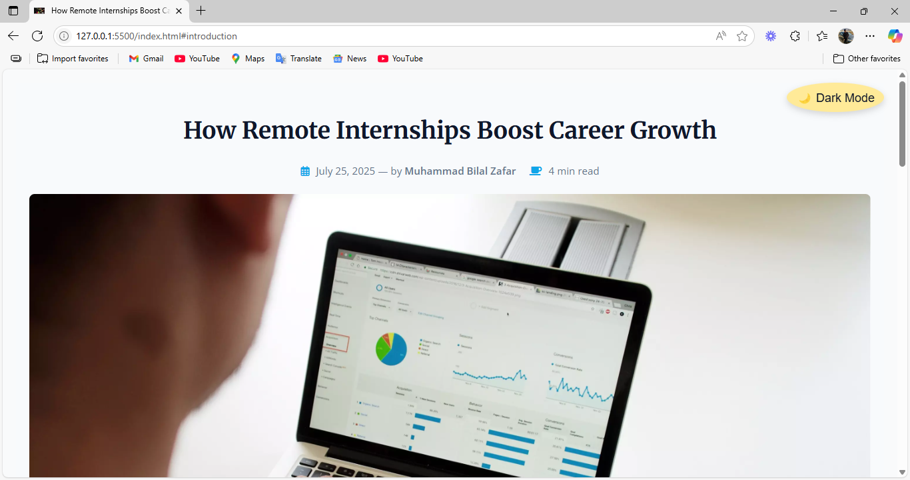
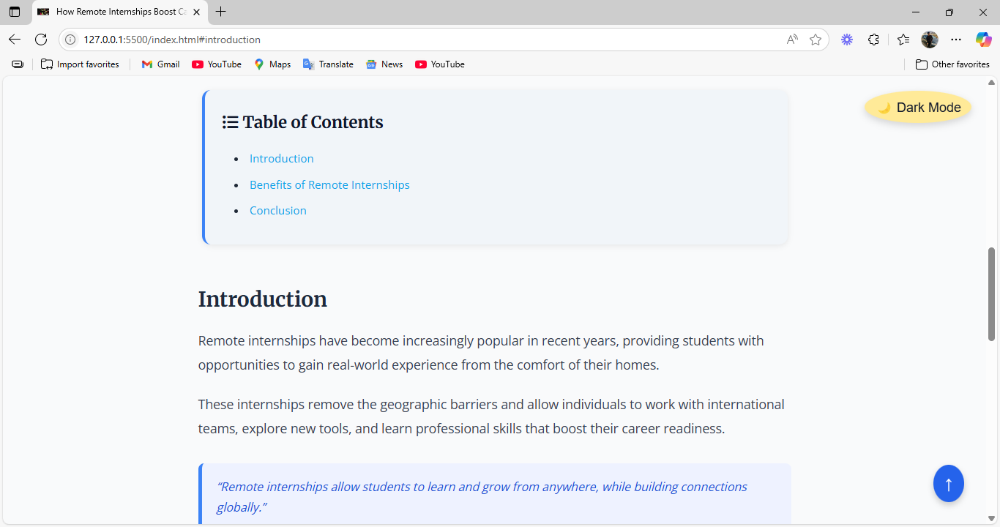
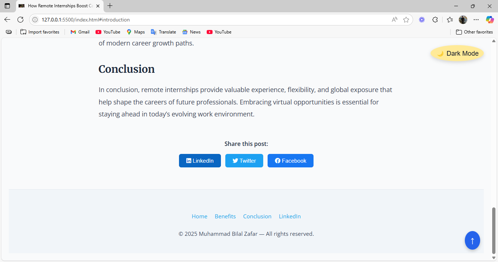

# 📝 Responsive Blog Post Page

A professional, responsive blog post page built with **HTML**, **CSS**, and **JavaScript**.  
This project was created as part of a Web Developer Internship Task to demonstrate clean layout, mobile responsiveness, and user-focused design.

## 🚀 Features

- 📑 Clean & structured blog layout
- 🖼️ Featured image with proper scaling
- 📅 Post metadata (date, author, read time)
- 📚 Table of Contents for easy navigation
- ✍️ Well-formatted blog content with headings, lists, and blockquotes
- 🔗 Social media sharing buttons (LinkedIn, Twitter, Facebook)
- 🔄 Responsive design for mobile, tablet, and desktop
- ☕ Estimated read time badge
- 🔼 Scroll to top button (with smooth scroll)
- 📱 Fully mobile-optimized
- 🌗 Optional dark mode ready (can be extended)
- 🔖 Favicon included

## 📸 Screenshots

### 🖥️ Desktop View

### 📱 Mobile View

### 📚 Table of Contents

### 🔗 Social Share Section

## 🛠️ Tech Stack

- HTML5
- CSS3
- JavaScript (Vanilla)
# responsive-blog
Built a modern, responsive blog page using HTML, CSS, and JavaScript. Implemented key features like social share buttons with hover effects, scroll-to-top, dark mode toggle, responsive table of contents, and enhanced mobile layout. Focused on accessibility, clean design, and user-friendly interaction
